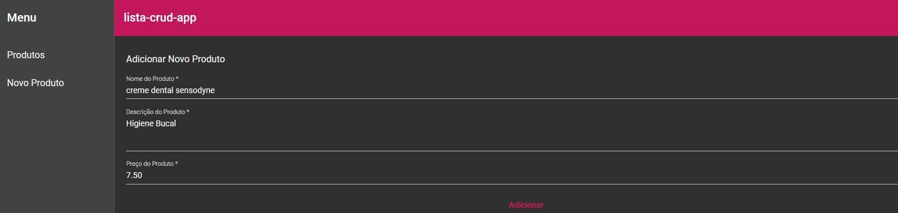
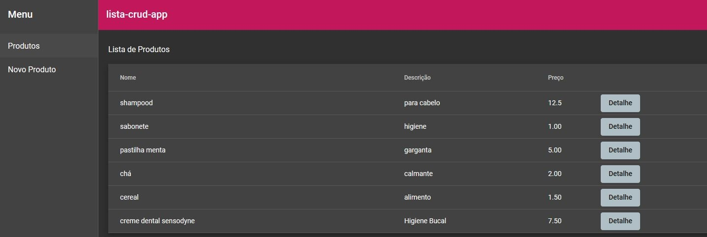
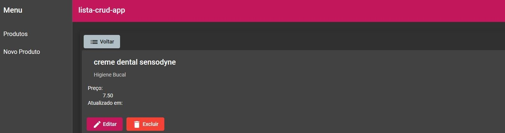

# ProdutosApp

# Indice

- [Sobre](#-sobre)
- [Tecnologias Utilizadas](#-tecnologias-utilizadas)
- [Criando o projeto](#-criando-o-projeto)

## 🔖&nbsp; Sobre

O projeto em desenvolvimento é um CRUD, que foi criado para fins de estudo.


<p align="center">
  <kbd>
    
  </kbd>
  &nbsp;&nbsp;&nbsp;&nbsp;
  <kbd>
    
  </kbd>
  &nbsp;&nbsp;&nbsp;&nbsp;
  <kbd>
    
  </kbd>
</p>

## 🚀 Tecnologias utilizadas

O projeto foi desenvolvido utilizando as seguintes tecnologias

- [Angular](https://angular.io/docs)
- [Angular Material](https://material.angular.io/)
- [JSON Server](https://www.npmjs.com/package/json-server)

## 🗂 Criando o projeto

```bash

    # Instale as ferramentas de linha de comando
    $ npm install -g @angular/cli
    $ ng --version

    # Criar o repositório
    $ ng new seu-app

    # Instalar as ferramentas
    $ ng add @angular/material
    $ ng generate @angular/material:nav menu
    $ ng g service api
    $ npm install -g json-server
    

    # Iniciar o projeto
    $ ng serve
    $ json-server --watch db.json
  ```
  ---
    
   
	   🚀 Desenvolvido por Luís Henrique.
   
   
   
